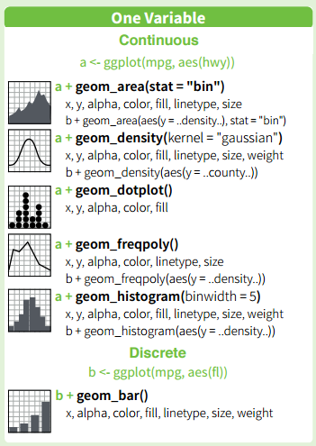
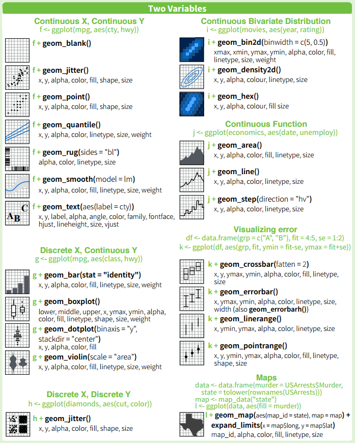
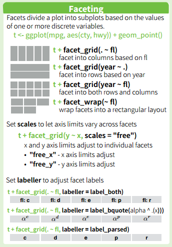

```{r setup, include=FALSE}
knitr::opts_chunk$set(echo = TRUE)
```

## CMS Public Data 
The data used in these slides is public data located on the CMS page [here](https://www.cms.gov/Research-Statistics-Data-and-Systems/Statistics-Trends-and-Reports/Chronic-Conditions/index.html).  I've arranged the data into a more usable format for this presentation which can be downloaded by clicking the button below.
```{r, echo=FALSE}
ccdat <- read.csv("chronic-conditions.csv")
  
  output$table <- renderTable({
    head(ccdat)
  })

output$downloadData <- downloadHandler(
  filename = 'chronic-conditions.csv',
  content = function(file) {
    write.csv(ccdat, file)}
    )
      
fluidRow(tableOutput('table'),
  downloadButton('downloadData', 'Download')
  )
```

To read the data into R run the following code:

    setwd("C:\\path\\to\\folder")
    # setwd("C:/path/to/folder")
    ccdat <- read.csv("chronic-conditions.csv")

## ggplot2 Basics

    # If you haven't already install the package and load the library.
    install.packages("ggplot2"); library(ggplot2)
    
### ggplot()
    
    # Add layers to ggplot() with '+'
    ggplot([insert data here], aes(x=[x-var], y=[y-var], color=[color-var], [...])) + geom_[graph type]
Layers can include combinations of "geoms", "stats", "scales", "faceting", "themes", etc.

### qplot()

    # Build a plot using the qplot() function
    qplot(x=[x-var], y=[y-var], color=[color-var], [...], data=[insert data here], geom = "[graph type]")
"Some introductions to ggplot2 make use of a function called qplot(), which is intended as a convenient interface for making graphs. It does require a little less typing than using ggplot() plus a geom, but I've found it a bit confusing to use because it has a slightly different way of specifying certain graphing parameters. I think it's simpler and easier to just use ggplot()." -Winston Chang (R Graphics Cookbook, 2012)

## Geoms (One Variable)
alldat <- ccdat[ccdat\$age=="All" & ccdat\$state=="National",] 
```{r, echo=FALSE}
library(ggplot2)

new.theme <- theme_update(axis.text = element_text(size=14),axis.title=element_text(size=18))
trim <- function (x) gsub("^\\s+|\\s+$", "", x)
ccdat$state <- trim(ccdat$state)
ccdat$year <- as.numeric(ccdat$year)
alldat <- ccdat[ccdat$age=="All" & ccdat$state=="National",]

checkboxInput("chkbx0",label="Free Text?",FALSE)

renderUI({
  if(!input$chkbx0){
fluidRow(
  column(12,
           selectInput("mycode0",label=NULL,
                   choices=c("ggplot(alldat,aes(x=prevalence)) + geom_histogram()",
                            "ggplot(alldat,aes(x=prevalence)) + geom_histogram(binwidth=5)",
                            "ggplot(alldat,aes(x=prevalence)) + geom_density()",
                            "ggplot(alldat,aes(x=prevalence,color=gender)) + geom_density()",
                            "ggplot(alldat,aes(x=prevalence,color=gender,fill=gender)) + geom_density(alpha=0.35)"),
                   selected = "ggplot(alldat,aes(x=prevalence)) + geom_histogram()",width="100%"),
         tags$style(type="text/css", ".selectize-dropdown { width: 100%; font-size: 18px; line-height: 18px;} .selectize-input { width: 100%; font-size: 20px; line-height: 20px;}")
  ))
         } else {
           
fluidRow(
  column(10,
         textInput("mycode0",label=NULL,
                   value="ggplot(alldat,aes(x=prevalence)) + geom_histogram()",width="100%"),
         tags$style(type="text/css", "#mycode0 { height: 36px; width: 100%; font-size: 18px; display: block;}")
  ),
  column(2,
         actionButton("submit0","Submit"),
         tags$style(type="text/css", "#submit0 { height: 36px; width: 100%; font-size: 18px; display: block;}")
  )
)
         }
  })

renderPlot({
  if(!input$chkbx0){
  eval(parse(text=input$mycode0))
  } else {
    input$submit0
    eval(parse(text=isolate(input$mycode0)))
  }
},height=375)

library(shinyBS)
fluidRow(
                            bsButton("q1", label = "", icon = icon("question"),
                                     style = "info", size = "extra-small"),
                            bsPopover(id = "q1", title = NULL,
                                      content = '',
                                      placement = "right", 
                                      trigger = "click", 
                                      options = list(container = "body")
                                      ),
         tags$style(type="text/css", ".popover { display:block !important; max-width: 800px!important; width:auto;}")
)
```

## Geoms (Two Variables)
alldat <- ccdat[ccdat\$age=="All" & ccdat\$state=="National",]
```{r, echo=FALSE}
library(ggplot2)

new.theme <- theme_update(axis.text = element_text(size=14),axis.title=element_text(size=18))

ccdat <- read.csv("chronic-conditions.csv")
trim <- function (x) gsub("^\\s+|\\s+$", "", x)
ccdat$state <- trim(ccdat$state)
ccdat$year <- as.numeric(ccdat$year)
alldat <- ccdat[ccdat$age=="All" & ccdat$state=="National",]

checkboxInput("chkbx",label="Free Text?",TRUE)

renderUI({
  if(!input$chkbx){
fluidRow(
  column(12,
           selectInput("mycode",label=NULL,
                   choices=c("ggplot(alldat,aes(x=year,y=prevalence)) + geom_point()",
                            "ggplot(alldat,aes(x=as.factor(year),y=prevalence)) + geom_boxplot()",
                            "ggplot(alldat,aes(x=year,y=prevalence)) + geom_smooth(method=lm)",
                            "ggplot(alldat,aes(x=year,y=prevalence)) + geom_point() + geom_smooth(method=lm)",
                            "ggplot(alldat,aes(x=year,y=prevalence,color=chronicCondition)) + geom_point() + geom_line()"),
                   selected = "ggplot(alldat,aes(x=year,y=prevalence)) + geom_point()",width="100%"),
         tags$style(type="text/css", ".selectize-dropdown { width: 100%; font-size: 18px; line-height: 18px;} .selectize-input { width: 100%; font-size: 20px; line-height: 20px;}")
  ))
    
         } else {
fluidRow(
  column(10,
         textInput("mycode",label=NULL,
                   value="ggplot(alldat,aes(x=year,y=prevalence)) + geom_point()",width="100%"),
         tags$style(type="text/css", "#mycode { height: 36px; width: 100%; font-size: 18px; display: block;}")
  ),
  column(2,
         actionButton("submit","Submit"),
         tags$style(type="text/css", "#submit { height: 36px; width: 100%; font-size: 18px; display: block;}")
  )
)
         }
})

renderPlot({
  if(!input$chkbx){
  eval(parse(text=input$mycode))
  } else {
    input$submit
    eval(parse(text=isolate(input$mycode)))
  }
},height=375)


fluidRow(
                            bsButton("q2", label = "", icon = icon("question"),
                                     style = "info", size = "extra-small"),
                            bsPopover(id = "q2", title = NULL,
                                      content = '',
                                      placement = "right", 
                                      trigger = "click", 
                                      options = list(container = "body")
                                      )
)
```

## Geoms (Two Variables) cont.
ut.diabetes <- ccdat[ccdat\$state=="Utah" & ccdat\$age=="All" & ccdat\$chronicCondition=="Diabetes",]
```{r, echo=FALSE}
ut.diabetes <- ccdat[ccdat$state=="Utah" & ccdat$age=="All" & ccdat$chronicCondition=="Diabetes",]

checkboxInput("chkbx3",label="Free Text?",TRUE)

renderUI({
  if(!input$chkbx3){
fluidRow(
  column(12,
           selectInput("mycode3",label=NULL,
                   choices=c("ggplot(ut.diabetes,aes(x=year,y=prevalence,fill=gender)) + geom_bar(stat=\"identity\",position=\"dodge\")",
                            "ggplot(ut.diabetes,aes(x=year,y=prevalence,color=gender)) + geom_line()"),
                   selected = "ggplot(ut.diabetes,aes(x=year,y=prevalence,fill=gender)) + geom_bar(stat=\"identity\",position=\"dodge\")",width="100%"),
         tags$style(type="text/css", ".selectize-dropdown { width: 100%; font-size: 14px; line-height: 14px;} .selectize-input { width: 100%; font-size: 16px; line-height: 16px;}")
  ))
    
         } else {

fluidRow(
  column(10,
         textInput("mycode3",label=NULL,
                   value="ggplot(ut.diabetes,aes(x=year,y=prevalence,fill=gender)) + geom_bar(stat=\"identity\",position=\"dodge\")",width="100%"),
         tags$style(type="text/css", "#mycode3 { height: 36px; width: 100%; font-size: 16px; display: block;}")
  ),
  column(2,
         actionButton("submit3","Submit"),
         tags$style(type="text/css", "#submit3 { height: 36px; width: 100%; font-size: 16px; display: block;}")
  )
)
         }
})

renderPlot({
  if(!input$chkbx3){
  eval(parse(text=input$mycode3))
  } else {
    input$submit3
    eval(parse(text=isolate(input$mycode3)))
  }
},height=375)


fluidRow(
                            bsButton("q3", label = "", icon = icon("question"),
                                     style = "info", size = "extra-small"),
                            bsPopover(id = "q3", title = NULL,
                                      content = '',
                                      placement = "right", 
                                      trigger = "click", 
                                      options = list(container = "body")
                                      ))
```


## Faceting
alldat <- ccdat[ccdat\$age=="All" & ccdat\$state=="National",]
```{r, echo=FALSE}
library(ggplot2)

new.theme <- theme_update(axis.text = element_text(size=14),axis.title=element_text(size=18))

ccdat <- read.csv("chronic-conditions.csv")
trim <- function (x) gsub("^\\s+|\\s+$", "", x)
ccdat$state <- trim(ccdat$state)
ccdat$year <- as.numeric(ccdat$year)
alldat <- ccdat[ccdat$age=="All" & ccdat$state=="National",]

checkboxInput("chkbx4",label="Free Text?",TRUE)

renderUI({
  if(!input$chkbx4){
fluidRow(
  column(12,
           selectInput("mycode4",label=NULL,
                   choices=c("ggplot(alldat,aes(x=year,y=prevalence,color=chronicCondition)) + geom_point() + geom_line()",
                            "ggplot(alldat,aes(x=year,y=prevalence,color=chronicCondition)) + geom_point() + geom_line() + facet_wrap(~gender)",
                            "ggplot(alldat,aes(x=year,y=prevalence,color=gender)) + geom_point() + geom_line() + facet_wrap(~chronicCondition)",
                            "ggplot(alldat,aes(x=year,y=prevalence,color=gender)) + geom_point() + geom_line() + facet_grid(gender~chronicCondition)"),
                   selected = "ggplot(alldat,aes(x=year,y=prevalence,color=chronicCondition)) + geom_point() + geom_line()",width="100%"),
         tags$style(type="text/css", ".selectize-dropdown { width: 100%; font-size: 18px; line-height: 18px;} .selectize-input { width: 100%; font-size: 20px; line-height: 20px;}")
  ))
    
         } else {

fluidRow(
  column(10,
         textInput("mycode4",label=NULL,
                   value="ggplot(alldat,aes(x=year,y=prevalence,color=chronicCondition)) + geom_point() + geom_line()",width="100%"),
         tags$style(type="text/css", "#mycode4 { height: 36px; width: 100%; font-size: 14px; display: block;}")
  ),
  column(2,
         actionButton("submit4","Submit"),
         tags$style(type="text/css", "#submit4 { height: 36px; width: 100%; font-size: 14px; display: block;}")
  )
)
         }
})

renderPlot({
  if(!input$chkbx4){
  eval(parse(text=input$mycode4))
  } else {
    input$submit4
    eval(parse(text=isolate(input$mycode4)))
  }
},height=375)


fluidRow(
                            bsButton("q4", label = "", icon = icon("question"),
                                     style = "info", size = "extra-small"),
                            bsPopover(id = "q4", title = NULL,
                                      content = '',
                                      placement = "right", 
                                      trigger = "click", 
                                      options = list(container = "body")
                                      )
                            )
```

## Citation

- [ggplot2 Cheat Sheet](https://www.rstudio.com/wp-content/uploads/2015/03/ggplot2-cheatsheet.pdf)
- CMS Medicare Chronic Conditions data from [cms.gov](https://www.cms.gov/Research-Statistics-Data-and-Systems/Statistics-Trends-and-Reports/Chronic-Conditions/index.html)
- [R Graphics Cookbook](http://www.cookbook-r.com/Graphs/) by Winston Chang


# Questions?